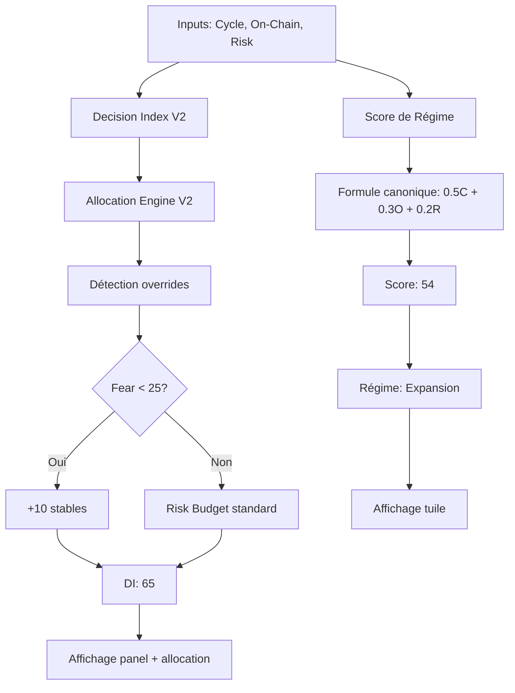

# Decision Index V2 - Système Dual de Scoring

> **Date**: Octobre 2025
> **Version**: 2.0 (Allocation Engine intégré)

## 📊 Vue d'Ensemble

Le système de scoring décisionnel utilise **DEUX méthodes parallèles** qui servent des objectifs différents:

| Métrique | Source | Formule | Usage | Localisation UI |
|----------|--------|---------|-------|-----------------|
| **Score de Régime** | Formule canonique | `0.5×CCS + 0.3×OnChain + 0.2×Risk` | Communication, régime marché | Tuile (Risk Panel gauche) |
| **Decision Index (DI)** | Allocation Engine V2 | Complexe (topdown hierarchical) | Allocation optimale, exécution | Panel Decision Index |

---

## 🎯 1. Score de Régime (Canonique)

### Formule
```
Score de Régime = 0.5 × CCS Mixte + 0.3 × On-Chain + 0.2 × Risk
```

### Caractéristiques
- ✅ **Simple**: Moyenne pondérée directe
- ✅ **Prévisible**: Toujours même formule
- ✅ **Transparent**: Facile à expliquer
- ⚠️ **Limité**: Ne prend pas en compte contexte complexe

### Calcul (Exemple)
```javascript
CCS Mixte = 58
On-Chain = 35
Risk = 76

Score de Régime = 0.5×58 + 0.3×35 + 0.2×76
                  = 29 + 10.5 + 15.2
                  = 54.7 ≈ 54
```

### Implémentation
**Fichier**: `static/modules/analytics-unified-main-controller.js`

```javascript
// Calcul direct dans le store
const blendedScore = Math.round(
  0.5 * ccsMixte +
  0.3 * onchainScore +
  0.2 * riskScore
);
```

---

## 🏗️ 2. Decision Index (Allocation Engine V2)

### Objectif
**Score de QUALITÉ de l'allocation** calculée par Allocation Engine V2 (topdown hierarchical).

⚠️ **IMPORTANT:** Le Decision Index N'EST PAS une somme pondérée des piliers!

### Formule Réelle
```javascript
// strategy-api-adapter.js ligne 448
const decisionScore = v2Allocation.metadata.total_check.isValid ? 65 : 45;
```

| Condition | DI | Signification |
|-----------|-----|---------------|
| **Allocation valide** | 65 | Allocation optimale trouvée, contraintes respectées |
| **Allocation invalide** | 45 | Problème (somme ≠ 100%, hiérarchie violée) |

### Ce que le DI Mesure

✅ **Qualité de l'allocation:**
- Cohérence interne (somme = 100%)
- Respect hiérarchie (pas de double-comptage)
- Validité des contraintes (caps, floors)
- Convergence possible vers target

❌ **Ce que le DI NE mesure PAS:**
- Somme pondérée des 3 piliers (c'est le Score de Régime!)
- Variation directe avec Cycle/OnChain/Risk
- Conditions de marché (c'est la Phase!)

### Architecture

```
┌─────────────────────────────────────────────────┐
│ Allocation Engine V2 (Topdown Hierarchical)    │
├─────────────────────────────────────────────────┤
│                                                 │
│  1. Phase Detection (cycle < 70 → bearish)      │
│  2. Macro Allocation (BTC/ETH/Stables/Alts)    │
│  3. Sector Allocation (avec floors contextuels)│
│  4. Coin Allocation (incumbency + meme caps)   │
│  5. Validation & Checksum                       │
│     └─ total_check.isValid → DI = 65 ou 45     │
│                                                 │
└─────────────────────────────────────────────────┘
```

### Implémentation
**Fichiers**:
- `static/core/strategy-api-adapter.js` (ligne 448)
- `static/core/allocation-engine.js` (calcul topdown V2)

```javascript
// Entry point
const decision = await calculateIntelligentDecisionIndexAPI(context);
// → {score: 65, source: 'allocation_engine_v2', confidence: 0.8, ...}

// Le score est FIXE (65 ou 45), pas variable!
```

### Poids Adaptatifs (pour l'allocation, pas le DI)
Les poids sont utilisés pour **calculer l'allocation**, pas le DI final:

| Condition | wCycle | wOnchain | wRisk | Usage |
|-----------|--------|----------|-------|-------|
| **Base** | 0.5 | 0.3 | 0.2 | Macro allocation |
| **Cycle ≥ 90** | 0.65 | 0.25 | 0.1 | Boost cycle fort |
| **Cycle ≥ 70** | 0.55 | 0.28 | 0.17 | Bull modéré |
| **Contradiction ≥ 50%** | +redistrib | ×0.9 | ×0.9 | Pénalise signaux conflictuels |

**Note:** Ces poids influencent l'ALLOCATION calculée, pas le score DI lui-même.

### Contributions Affichées
Les **pourcentages affichés** dans le panel (ex: 53% / 19% / 28%) sont les **contributions relatives effectives**, calculées APRÈS tous les ajustements:

```javascript
const total = wCycle * scoreCycle + wOnchain * scoreOnchain + wRisk * scoreRisk;
const contribCycle = (wCycle * scoreCycle) / total;     // Ex: 53%
const contribOnchain = (wOnchain * scoreOnchain) / total; // Ex: 19%
const contribRisk = (wRisk * scoreRisk) / total;         // Ex: 28%
```

⚠️ **Ces valeurs NE SONT PAS les poids d'entrée** (50/30/20)!

---

## ⚡ 3. Overrides Contextuels

Le Decision Index peut être **modifié par des facteurs externes**:

### Override #1: ML Sentiment Extrême

⚠️ **TERMINOLOGIE**: Le système utilise "ML Sentiment" (0-100), PAS le Fear & Greed Index officiel d'alternative.me!

**Source de données**:
- **Nom UI**: ML Sentiment
- **Endpoint**: `/api/ml/sentiment/symbol/BTC`
- **Calcul**: `50 + (sentiment_ml * 50)` où sentiment_ml ∈ [-1, 1]
- **Exemple**: sentiment ML = 0.6 → ML Sentiment affiché = **80** (Extreme Greed)
- **Agrège**: ML models + Social sentiment + News sentiment

**Différence avec l'index officiel**:
- Alternative.me Fear & Greed Index: **25** (Extreme Fear) - NON utilisé
- ML Sentiment (système): **80** (Extreme Greed) - UTILISÉ
- Le système agrège plusieurs sources ML en temps réel

```javascript
if (mlSentiment < 25) {
  // Force allocation défensive
  stablesTarget += 10; // +10 points de stables
  riskyTarget -= 10;

  // Badge affiché: "🚨 ML Sentiment Extrême (15)"
}
```

**Exemple**:
- ML Sentiment = 15 (panic extrême selon sentiment agrégé)
- Régime détecté = "Expansion" (Blended 54 → range 40-69)
- **Override appliqué** → Allocation 61% stables (au lieu de 30%)

### Override #2: Contradiction Élevée
```javascript
if (contradiction > 0.5) {
  // Pénalise On-Chain et Risk
  wOnchain *= 0.9;
  wRisk *= 0.9;
  wCycle += redistribution;

  // Badge affiché: "⚠️ Contradiction (48%)"
}
```

### Override #3: Structure Faible
```javascript
if (structureScore < 50) {
  stablesTarget += 10; // +10 points de stables
  deltaCap -= 0.5;      // Cap réduit
}
```

---

## 🔍 4. Pourquoi Deux Systèmes?

### Scénario Réel (Octobre 2025)

**Inputs**:
- CCS Mixte: 58
- On-Chain: 35
- Risk: 76
- ML Sentiment: **15** (extrême panic selon sentiment agrégé)

**Score de Régime** = 54 ✅
```
0.5×58 + 0.3×35 + 0.2×76 = 54
```
→ Régime détecté: **"Expansion"** (range 40-69)
→ Allocation théorique: ~30% stables

**Decision Index** = 65 ✅
```
Allocation Engine V2 détecte:
- Fear extrême (15 < 25) → Override défensif
- Risk Budget recalculé: 63% stables
- Structure Score: 83 → -5% stables
- Final: 58% stables recommandés
→ DI = 65 (qualité allocation optimale)
```

**Résultat**:
- ✅ **Score de Régime** communique le "régime général" (Expansion)
- ✅ **Decision Index** adapte l'allocation au contexte réel (Fear panic)
- ✅ **Recommandation finale**: 58-61% stables (défensif) malgré régime Expansion

---

## 📖 5. Interprétation pour IA

### Question Fréquente
> "Pourquoi le DI (65) est différent du Score de Régime (54)?"

**Réponse**:
1. Le **Score de Régime** est une **moyenne simple** des 3 piliers (formule canonique)
2. Le **Decision Index** est un **score stratégique** calculé par Allocation Engine V2
3. Ils servent des **objectifs différents**:
   - Score de Régime → Communication, cohérence, régime général
   - Decision Index → Allocation optimale, prise en compte overrides

### Flowchart de Décision



---

## 🛠️ 6. Debug & Vérification

### Commandes Console (Browser)

```javascript
// 1) Charger état unifié
const { getUnifiedState } = await import('./core/unified-insights-v2.js');
const u = await getUnifiedState();

// 2) Comparer les deux scores
console.table({
  'Score de Régime': store.get('scores.blended'),
  'Decision Index': u.decision.score,
  'Source DI': u.decision.source,
  'Différence': Math.abs(store.get('scores.blended') - u.decision.score)
});

// 3) Vérifier overrides
console.log('Overrides actifs:', {
  fearML: u.sentiment?.value,  // Sentiment ML converti (0-100)
  contradiction: store.get('governance.contradiction_index'),
  structure: u.intelligence?.structure_score
});

// 4) Vérifier poids adaptatifs
console.log('Poids:', u.decision.weights);
```

### Logs Serveur

Chercher dans `logs/app.log`:
```bash
grep "Strategy API decision" logs/app.log | tail -1
grep "Risk Budget from cache" logs/app.log | tail -1
```

---

## 📚 7. Références

### Documentation
- Architecture: [ARCHITECTURE.md](ARCHITECTURE.md)
- Risk Semantics: [RISK_SEMANTICS.md](RISK_SEMANTICS.md)
- Unified Insights V2: [UNIFIED_INSIGHTS_V2.md](UNIFIED_INSIGHTS_V2.md)
- CLAUDE.md: Section "Decision Index vs Score de Régime"

### Code Source
- Decision Index Panel: `static/components/decision-index-panel.js`
- Allocation Engine V2: `static/core/allocation-engine.js`
- Strategy API Adapter: `static/core/strategy-api-adapter.js`
- Unified Insights V2: `static/core/unified-insights-v2.js`

### Tests
```bash
# Tester cohérence
pytest tests/unit/test_decision_index.py

# Tester allocation
pytest tests/unit/test_allocation_engine_v2.py
```

---

## ✅ Checklist IA

**Avant de modifier quoi que ce soit**, vérifier:

1. ☐ Je comprends la différence entre Score de Régime et Decision Index
2. ☐ Je sais quelle méthode modifier selon l'objectif (communication vs allocation)
3. ☐ J'ai vérifié les overrides actifs (Fear, Contradiction, Structure)
4. ☐ J'ai lu la section "Overrides" dans le texte d'aide du panel
5. ☐ Je comprends que les contributions affichées ≠ poids d'entrée
6. ☐ J'ai testé ma modification avec les deux scores

**En cas de doute**: Demander à l'utilisateur quel système il souhaite modifier!

---

*Dernière mise à jour: 2025-10-22*
