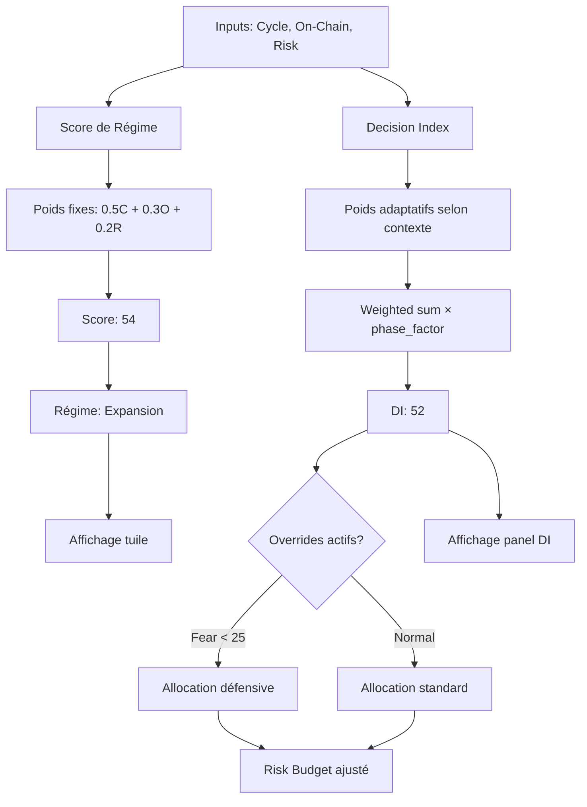

# Decision Index V2 - Système Dual de Scoring

> **Date**: Février 2026
> **Version**: 2.1 (Macro Stress DXY/VIX intégré)

## Vue d'Ensemble

Le système de scoring décisionnel utilise **DEUX méthodes parallèles** qui servent des objectifs différents:

| Métrique | Source | Formule | Usage | Localisation UI |
|----------|--------|---------|-------|-----------------|
| **Score de Régime** | Formule canonique | `0.5×CCS + 0.3×OnChain + 0.2×Risk` | Communication, régime marché | Tuile (Risk Panel gauche) |
| **Decision Index (DI)** | Allocation Engine V2 | Complexe (topdown hierarchical) | Allocation optimale, exécution | Panel Decision Index |

---

## 1. Score de Régime (Canonique)

### Formule
```
Score de Régime = 0.5 × CCS Mixte + 0.3 × On-Chain + 0.2 × Risk
```

### Caractéristiques
- [OK] **Simple**: Moyenne pondérée directe
- [OK] **Prévisible**: Toujours même formule
- [OK] **Transparent**: Facile à expliquer
- [Warning] **Limité**: Ne prend pas en compte contexte complexe

### Calcul (Exemple)
```javascript
CCS Mixte = 58
On-Chain = 35
Risk = 76

Score de Régime = 0.5×58 + 0.3×35 + 0.2×76
                  = 29 + 10.5 + 15.2
                  = 54.7 ≈ 54
```

### Implémentation
**Fichier**: `static/modules/analytics-unified-main-controller.js`

```javascript
// Calcul direct dans le store
const blendedScore = Math.round(
  0.5 * ccsMixte +
  0.3 * onchainScore +
  0.2 * riskScore
);
```

---

## 2. Decision Index (Score Décisionnel)

### Objectif
**Score stratégique composite (0-100)** calculé par pondération des piliers avec ajustements contextuels.

[Warning] **IMPORTANT:** Le Decision Index EST une somme pondérée des 4 composantes (pas 3!), modulée par un facteur de phase.

### Formule Réelle (Backend - Source de Vérité)
**Fichier**: `services/execution/strategy_registry.py` lignes 252-262

```python
# 4 composantes (pas 3!)
raw_decision_score = (
    cycle_score * weights.cycle +           # ~0.2-0.35
    onchain_score * weights.onchain +       # ~0.3-0.4
    risk_score * weights.risk_adjusted +    # ~0.15-0.4
    sentiment_score * weights.sentiment     # ~0.1
)

# Ajustement par phase (basé sur cycle_score seul)
# bearish (cycle < 70): phase_factor = 0.85
# moderate (70 ≤ cycle < 90): phase_factor = 1.0
# bullish (cycle ≥ 90): phase_factor = 1.05
adjusted_score = raw_decision_score * phase_factor

# Pénalité macro graduée (Feb 2026, calibrée DI Backtest V2)
# VIX: 0 (≤20) → -10 (≥45), DXY: 0 (≤2%) → -8 (≥10%), cap -15
from services.macro_stress import macro_stress_service
macro_penalty = macro_stress_service.get_cached_penalty()  # 0.0 à -15.0 (graduée)
adjusted_score += macro_penalty

# Clamp final 0-100
final_score = max(0.0, min(100.0, adjusted_score))
```

**API Spec**: `api/strategy_endpoints.py` ligne 32
```python
decision_score: float = Field(..., ge=0, le=100, description="Score décisionnel 0-100")
```

### Range de Valeurs

| Conditions | DI Range | Exemple |
|-----------|----------|---------|
| **Bear extreme** (tous scores bas) | 0-30 | Cycle=20, OnChain=25, Risk=30, Sentiment=20 → ~25 |
| **Bear moderate** | 30-45 | Cycle=40, OnChain=35, Risk=50 → ~42 |
| **Neutral** | 45-60 | Cycle=55, OnChain=50, Risk=60 → ~55 |
| **Bull moderate** | 60-75 | Cycle=70, OnChain=65, Risk=70 → ~68 |
| **Bull extreme** (tous scores élevés) | 75-100 | Cycle=90, OnChain=85, Risk=90 → ~88 |

### Ce que le DI Mesure

[OK] **Position stratégique du marché:**
- Pondération des 4 piliers (Cycle, OnChain, Risk, Sentiment)
- Ajustement par phase de marché (bullish/bearish)
- Niveau de confiance pour allocation agressive vs défensive
- Guide pour ratio stables/risky et exposition maximale

[Error] **Ce que le DI NE mesure PAS:**
- Qualité technique de l'allocation (voir "Allocation Validity Check" ci-dessous)
- Somme = 100% (ça c'est le check de validité)
- Respect des contraintes hiérarchiques

### Conditions vs Phase vs Regime (Fév 2026)

Le DI panel affiche trois concepts distincts :

| Concept | Source | Signification |
| ------- | ------ | ------------- |
| **Conditions** | Blended score SANS Risk (CCS + OnChain) | Market outlook composite |
| **Phase** | Cycle score seul (<70=bearish, 70-90=moderate, ≥90=bullish) | Applied strategy |
| **Regime** (page Market Regimes) | ML detection per asset (HMM + rules) | Actual asset drawdown/volatility |

**Pourquoi Conditions ≠ Regime ?**

- Conditions reflète un score composite multi-pilier (sans Risk qui mesure la robustesse portfolio, pas la direction marché)
- Regime détecte le drawdown réel par asset (ex: BTC à -43% = Bear Market)
- Il est normal que Conditions = "Correction" alors que Regime BTC = "Bear Market"

**Calcul du regime score** (dans `getRegimeDisplayData()`):

```javascript
// Remove Risk influence: Risk measures portfolio health, not market direction
regimeScore = Math.floor((blendedScore - riskScore * 0.20) / 0.80)
```

### Allocation Validity Check (interne uniquement)

**Note (Jan 2026)**: Le bug qui affichait 65/45 au lieu du vrai DI a été corrigé.

Le check `v2Allocation.metadata.total_check.isValid` est maintenant utilisé **uniquement en interne** pour valider la qualité technique de l'allocation calculée (somme = 100%, contraintes respectées).

**Fichier**: `static/core/strategy-api-adapter.js` - `convertV2AllocationToLegacyFormat()`

Le Decision Index affiché est désormais calculé correctement avec la formule pondérée:

```javascript
const decisionScore = Math.round(
  (cycleScore * wCycle + onchainScore * wOnchain + riskScore * wRisk) * phaseFactor
);
```

### Architecture

```
┌─────────────────────────────────────────────────┐
│ Decision Index Calculation (Backend)            │
├─────────────────────────────────────────────────┤
│                                                 │
│  1. Collect Scores (Cycle, OnChain, Risk, Sent) │
│  2. Apply Adaptive Weights (context-aware)      │
│  3. Weighted Sum → raw_decision_score           │
│  4. Phase Multiplier (bull/bear/moderate)       │
│  4b. Macro Penalty (VIX/DXY graduated, cap -15)  │
│  5. Clamp to [0, 100] → final_decision_score    │
│                                                 │
└─────────────────────────────────────────────────┘
```

### Implémentation
**Fichiers principaux**:
- `services/execution/strategy_registry.py` (backend - source de vérité)
- `api/strategy_endpoints.py` (API spec)
- `static/core/unified-insights-v2.js` (frontend mirror)
- `static/modules/simulation-engine.js` (simulateur)

**Simulation**:
Le simulateur permet de tester toute la plage 0-100 via `simulations.html`

### Poids Adaptatifs (pour l'allocation, pas le DI)
Les poids sont utilisés pour **calculer l'allocation**, pas le DI final:

| Condition | wCycle | wOnchain | wRisk | Usage |
|-----------|--------|----------|-------|-------|
| **Base** | 0.5 | 0.3 | 0.2 | Macro allocation |
| **Cycle ≥ 90** | 0.65 | 0.25 | 0.1 | Boost cycle fort |
| **Cycle ≥ 70** | 0.55 | 0.28 | 0.17 | Bull modéré |
| **Contradiction ≥ 50%** | +redistrib | ×0.9 | ×0.9 | Pénalise signaux conflictuels |

**Note:** Ces poids influencent l'ALLOCATION calculée, pas le score DI lui-même.

### Contributions Affichées
Les **pourcentages affichés** dans le panel (ex: 53% / 19% / 28%) sont les **contributions relatives effectives**, calculées APRÈS tous les ajustements:

```javascript
const total = wCycle * scoreCycle + wOnchain * scoreOnchain + wRisk * scoreRisk;
const contribCycle = (wCycle * scoreCycle) / total;     // Ex: 53%
const contribOnchain = (wOnchain * scoreOnchain) / total; // Ex: 19%
const contribRisk = (wRisk * scoreRisk) / total;         // Ex: 28%
```

[Warning] **Ces valeurs NE SONT PAS les poids d'entrée** (50/30/20)!

---

## 3. Overrides Contextuels

Le Decision Index peut être **modifié par des facteurs externes**:

### Override #1: ML Sentiment Extrême

[Warning] **TERMINOLOGIE**: Le système utilise "ML Sentiment" (0-100), PAS le Fear & Greed Index officiel d'alternative.me!

**Source de données**:
- **Nom UI**: ML Sentiment
- **Endpoint**: `/api/ml/sentiment/symbol/BTC`
- **Calcul**: `50 + (sentiment_ml * 50)` où sentiment_ml ∈ [-1, 1]
- **Exemple**: sentiment ML = 0.6 → ML Sentiment affiché = **80** (Extreme Greed)
- **Agrège**: ML models + Social sentiment + News sentiment

**Différence avec l'index officiel**:
- Alternative.me Fear & Greed Index: **25** (Extreme Fear) - NON utilisé
- ML Sentiment (système): **80** (Extreme Greed) - UTILISÉ
- Le système agrège plusieurs sources ML en temps réel

```javascript
if (mlSentiment < 25) {
  // Force allocation défensive
  stablesTarget += 10; // +10 points de stables
  riskyTarget -= 10;

  // Badge affiché: "[Alert] ML Sentiment Extrême (15)"
}
```

**Exemple**:
- ML Sentiment = 15 (panic extrême selon sentiment agrégé)
- Régime détecté = "Expansion" (Blended 54 → range 40-69)
- **Override appliqué** → Allocation 61% stables (au lieu de 30%)

### Override #2: Contradiction Élevée
```javascript
if (contradiction > 0.5) {
  // Pénalise On-Chain et Risk
  wOnchain *= 0.9;
  wRisk *= 0.9;
  wCycle += redistribution;

  // Badge affiché: "[Warning] Contradiction (48%)"
}
```

### Override #3: Structure Faible
```javascript
if (structureScore < 50) {
  stablesTarget += 10; // +10 points de stables
  deltaCap -= 0.5;      // Cap réduit
}
```

### Override #4: Macro Stress (VIX/DXY) — Graduée (Feb 2026)

**Source de données**:
- **VIX**: CBOE Volatility Index via FRED (série VIXCLS)
- **DXY**: Trade Weighted U.S. Dollar Index via FRED (série DTWEXBGS)
- **Endpoint**: `/proxy/fred/macro-stress`
- **Cache**: 4 heures (partagé avec Decision Index)

**Pénalité graduée linéaire** (calibrée sur DI Backtest V2):
```python
# services/macro_stress.py
# VIX: 0 pts (≤20) → -10 pts (≥45), linéaire
# DXY 30j change: 0 pts (≤2%) → -8 pts (≥10%), linéaire
# Total = VIX + DXY, cappé à -15 pts

VIX_PENALTY_START = 20.0       # Début de pénalité
VIX_PENALTY_MAX_LEVEL = 45.0   # Pénalité max atteinte
VIX_PENALTY_MAX_PTS = 10.0     # -10 pts max VIX seul

DXY_CHANGE_START_PCT = 2.0     # Début de pénalité DXY
DXY_CHANGE_MAX_PCT = 10.0      # Pénalité max atteinte
DXY_PENALTY_MAX_PTS = 8.0      # -8 pts max DXY seul

TOTAL_PENALTY_CAP = -15.0      # Cap total
```

**Exemples**:
- VIX=25 → pénalité -2.0 pts
- VIX=35 → pénalité -6.0 pts
- VIX=35 + DXY change=6% → pénalité -10.0 pts (additif: -6.0 + -4.0)
- VIX=50 + DXY change=12% → pénalité -15.0 pts (cappé)

**Pourquoi graduée (et non binaire)?** Le DI Backtest V2 (walk-forward, 288 backtests) a montré que la pénalité binaire -15 écrasait le DI pendant des mois entiers (tout 2022). La graduation linéaire est proportionnelle au stress réel et produit une meilleure rétention OOS.

**Fichiers**:
- Service: `services/macro_stress.py`
- Intégration: `services/execution/strategy_registry.py:265-272`
- API: `api/main.py` (endpoints `/proxy/fred/*`)
- Tests: `tests/unit/test_macro_stress.py`

---

## 4. Pourquoi Deux Systèmes?

### Scénario Réel (Octobre 2025)

**Inputs**:
- CCS Mixte: 58
- On-Chain: 35
- Risk: 76
- ML Sentiment: **15** (extrême panic selon sentiment agrégé)

**Score de Régime** = 54 [OK]
```
0.5×58 + 0.3×35 + 0.2×76 = 54
```
→ Régime détecté: **"Expansion"** (range 40-69)
→ Allocation théorique: ~30% stables

**Decision Index** = 52 [OK]
```
Calcul pondéré (formule backend):
DI = (58 × 0.5) + (35 × 0.3) + (76 × 0.2) × phase_factor
   = 29 + 10.5 + 15.2 = 54.7
   × 0.95 (phase bearish car Fear extrême) = 52

Allocation ajustée séparément:
- Fear extrême (15 < 25) → Override défensif
- Risk Budget recalculé: 63% stables
- Final: 58% stables recommandés
```

**Résultat**:
- [OK] **Score de Régime** = 54 (formule canonique 0.5C + 0.3O + 0.2R)
- [OK] **Decision Index** = 52 (même formule × phase_factor)
- [OK] **Recommandation finale**: 58-61% stables (défensif via overrides)

---

## 5. Interprétation pour IA

### Question Fréquente
> "Pourquoi le DI (52) est proche mais différent du Score de Régime (54)?"

**Réponse**:

1. Le **Score de Régime** est une **moyenne simple** des 3 piliers (formule canonique fixe)
2. Le **Decision Index** utilise la **même formule** mais avec poids adaptatifs + phase_factor
3. Les deux utilisent les mêmes inputs (Cycle, OnChain, Risk) mais:
   - Score de Régime → Poids fixes (0.5/0.3/0.2), pas d'ajustement phase
   - Decision Index → Poids adaptatifs selon contexte × multiplicateur de phase

### Flowchart de Décision


```mermaid
graph TD
    A[Inputs: Cycle, On-Chain, Risk] --> B[Score de Régime]
    A --> C[Decision Index]

    B --> D[Poids fixes: 0.5C + 0.3O + 0.2R]
    D --> E[Score: 54]
    E --> F[Régime: Expansion]

    C --> G[Poids adaptatifs selon contexte]
    G --> H[Weighted sum × phase_factor]
    H --> I[DI: 52]

    I --> J{Overrides actifs?}
    J -->|Fear < 25| K[Allocation défensive]
    J -->|Normal| L[Allocation standard]

    F --> M[Affichage tuile]
    I --> N[Affichage panel DI]
    K --> O[Risk Budget ajusté]
    L --> O
```

---

## 6. Debug & Vérification

### Commandes Console (Browser)

```javascript
// 1) Charger état unifié
const { getUnifiedState } = await import('./core/unified-insights-v2.js');
const u = await getUnifiedState();

// 2) Comparer les deux scores
console.table({
  'Score de Régime': store.get('scores.blended'),
  'Decision Index': u.decision.score,
  'Source DI': u.decision.source,
  'Différence': Math.abs(store.get('scores.blended') - u.decision.score)
});

// 3) Vérifier overrides
console.log('Overrides actifs:', {
  fearML: u.sentiment?.value,  // Sentiment ML converti (0-100)
  contradiction: store.get('governance.contradiction_index'),
  structure: u.intelligence?.structure_score
});

// 4) Vérifier poids adaptatifs
console.log('Poids:', u.decision.weights);
```

### Logs Serveur

Chercher dans `logs/app.log`:
```bash
grep "Strategy API decision" logs/app.log | tail -1
grep "Risk Budget from cache" logs/app.log | tail -1
```

---

## 7. Références

### Documentation
- Architecture: [ARCHITECTURE.md](ARCHITECTURE.md)
- Risk Semantics: [RISK_SEMANTICS.md](RISK_SEMANTICS.md)
- Unified Insights V2: [UNIFIED_INSIGHTS_V2.md](UNIFIED_INSIGHTS_V2.md)
- CLAUDE.md: Section "Decision Index vs Score de Régime"

### Code Source
- Decision Index Panel: `static/components/decision-index-panel.js`
- Allocation Engine V2: `static/core/allocation-engine.js`
- Strategy API Adapter: `static/core/strategy-api-adapter.js`
- Unified Insights V2: `static/core/unified-insights-v2.js`
- Macro Stress Service: `services/macro_stress.py`
- Strategy Registry (DI calc): `services/execution/strategy_registry.py`

### Tests
```bash
# Tester cohérence
pytest tests/unit/test_decision_index.py

# Tester allocation
pytest tests/unit/test_allocation_engine_v2.py
```

---

## Checklist IA

**Avant de modifier quoi que ce soit**, vérifier:

- [ ] Je comprends la différence entre Score de Régime et Decision Index
- [ ] Je sais quelle méthode modifier selon l'objectif (communication vs allocation)
- [ ] J'ai vérifié les overrides actifs (Fear, Contradiction, Structure)
- [ ] J'ai lu la section "Overrides" dans le texte d'aide du panel
- [ ] Je comprends que les contributions affichées ≠ poids d'entrée
- [ ] J'ai testé ma modification avec les deux scores

**En cas de doute**: Demander à l'utilisateur quel système il souhaite modifier!

---

## 8. Calibration Production — Decisions issues du DI Backtest V2

> Ajout: 8 Fev 2026. Resultats complets: [`DI_BACKTEST_MODULE.md`](DI_BACKTEST_MODULE.md)

Le module DI Backtest V2 (walk-forward valide, retention 140-155%, 288 backtests) a revele plusieurs ecarts entre le backtest et la production. Ce tableau documente les decisions prises pour chaque ecart.

### Audit comparatif

| Composant | Production | Backtest V2 | Decision | Raison |
|-----------|-----------|-------------|----------|--------|
| **Macro penalty** | ~~Binaire -15~~ → **Graduee lineaire** | Graduee (VIX 0→-10, DXY 0→-8, cap -15) | **Implemente** (P0) | Plus gros gain identifie. Binaire ecrasait le DI pendant des mois |
| **Phase factor** | Asset-based (BTC/ETH/LARGE/ALT) | Continu 0.85→1.05 via raw_score | **Pas de changement** | Systemes non-comparables: prod = ML rotation, backtest = seuils cycle_score |
| **Cycle source** | PhaseEngine ML (rotation) | Sigmoide halvings | **Diagnostic prospectif** (P1b) | Correlation inversee en OOS pour sigmoid. Script `diagnose_phase_engine.py` cree |
| **Risk normalization** | Fixed additive deltas | Expanding percentile | **Pas de changement** | Sources differentes (metriques live vs proxy prix). Percentile inadapte au live |
| **Asymmetric alpha** | Implicite (Freeze/Slow/Normal/Aggressive + hysteresis) | EMA bull=0.15, bear=0.50 | **Pas de changement** | Mecanisme different, effet similaire. Asymetrie deja presente en production |

### Le DI n'est PAS un signal de trading

Le backtest confirme que l'allocation basee directement sur le DI (DI modulation) **n'apporte pas de valeur ajoutee** (desactivee par defaut dans le backtest, capture asymmetry negative pour toutes les variantes S9).

**Flow reel en production:**

```
MLSignals (contradiction, confidence) → PolicyEngine → Policy (mode/cap/ramp)
                                            ↑ le DI n'intervient PAS ici

StrategyRegistry → DI (decision_score) → Dashboard display uniquement
                 → policy_hint (informatif, pas utilise par PolicyEngine)
```

Le DI reste utile comme:

1. **Score de communication** — dashboard, conditions display, monitoring
2. **PAS** comme input pour la PolicyEngine (qui utilise contradiction + confidence)
3. **PAS** comme signal de trading direct ou modulateur d'allocation

Les decisions d'allocation restent basees sur le cycle + phase + governance rules.

### Scripts de diagnostic

| Script | Description |
|--------|-------------|
| `scripts/analysis/diagnose_phase_engine.py --collect` | Collecteur prospectif phase engine (cron) |
| `scripts/analysis/diagnose_phase_engine.py --analyze` | Analyse biais phase (apres 30+ jours) |
| `scripts/analysis/diagnose_di_components.py` | Diagnostic IS vs OOS (KS tests, correlations) |
| `scripts/analysis/walk_forward_rotation_v2.py` | Walk-forward expanding V1 vs V2 |

---

*Derniere mise a jour: 2026-02-08*
