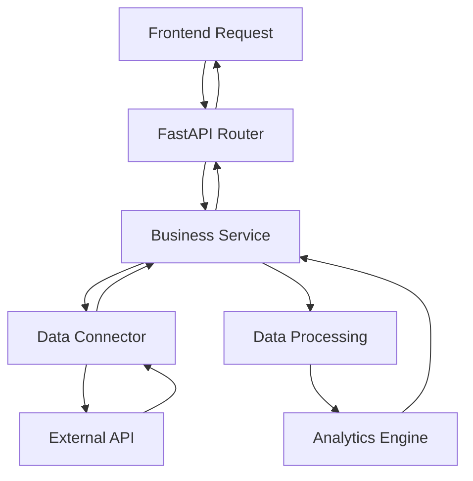

# DEPRECATED — See docs/architecture.md

# Technical Architecture - Crypto Rebalancer

## 🏗️ Vue d'ensemble de l'architecture

Le Crypto Rebalancer est une plateforme institutionnelle de trading et risk management construite avec une architecture modulaire et extensible. Cette documentation détaille l'architecture technique, les patterns utilisés, et les choix de conception.

## 📋 Table des matières

- [Stack Technologique](#-stack-technologique)
- [Architecture Générale](#-architecture-générale)
- [Modules Core](#-modules-core)
- [Architecture des Données](#-architecture-des-données)
- [Patterns & Conventions](#-patterns--conventions)
- [Sécurité & Performance](#-sécurité--performance)
- [Déploiement & Scalabilité](#-déploiement--scalabilité)

---

## 🛠️ Stack Technologique

### Backend
- **FastAPI** 0.115.0 - Framework web moderne avec validation automatique
- **Uvicorn** 0.30.6 - Serveur ASGI haute performance
- **Pydantic** 2.9.2 - Validation et sérialisation des données
- **Python** 3.9+ - Langage principal avec support async/await
- **aiohttp** 3.9.0+ - Client HTTP asynchrone
- **numpy** 1.21.0+ - Calculs numériques et analytics

### Frontend
- **HTML5 + Vanilla JavaScript** - Interface utilisateur légère
- **CSS3** avec variables et theming - Stylisation moderne
- **Chart.js** - Visualisations interactives
- **Local Storage** - Persistance côté client

### Intégrations
- **CoinTracking API** - Données portfolio principales
- **CoinGecko API** - Données de prix et métadonnées
- **Binance API** - Prix alternatifs et trading
- **Kraken API** - Trading et exécution d'ordres

### Outils & Standards
- **python-dotenv** - Gestion de configuration
- **Structured Logging** - Observabilité et debugging
- **JSON Schema** - Validation des données
- **OpenAPI/Swagger** - Documentation API automatique

---

## 🏛️ Architecture Générale

### Modèle en Couches

```
┌─────────────────────────────────────────────────────────────┐
│                    PRESENTATION LAYER                       │
│  ┌─────────────┐ ┌─────────────┐ ┌─────────────┐          │
│  │  Frontend   │ │  API Docs   │ │   Mobile    │          │
│  │   (HTML)    │ │  (Swagger)  │ │   (Future)  │          │
│  └─────────────┘ └─────────────┘ └─────────────┘          │
└─────────────────────────────────────────────────────────────┘
                              │
┌─────────────────────────────────────────────────────────────┐
│                      API LAYER                              │
│  ┌─────────────┐ ┌─────────────┐ ┌─────────────┐          │
│  │   FastAPI   │ │   Routers   │ │ Middlewares │          │
│  │    Core     │ │  (15+ APIs) │ │ (CORS, etc) │          │
│  └─────────────┘ └─────────────┘ └─────────────┘          │
└─────────────────────────────────────────────────────────────┘
                              │
┌─────────────────────────────────────────────────────────────┐
│                   BUSINESS LOGIC LAYER                      │
│  ┌─────────────┐ ┌─────────────┐ ┌─────────────┐          │
│  │  Services   │ │   Engine    │ │  Analytics  │          │
│  │  (20+ mods) │ │ (Rebalance) │ │ (Risk/Perf) │          │
│  └─────────────┘ └─────────────┘ └─────────────┘          │
└─────────────────────────────────────────────────────────────┘
                              │
┌─────────────────────────────────────────────────────────────┐
│                   DATA ACCESS LAYER                         │
│  ┌─────────────┐ ┌─────────────┐ ┌─────────────┐          │
│  │ Connectors  │ │   Pricing   │ │   Storage   │          │
│  │ (CT/Kraken) │ │  (Hybrid)   │ │ (File/Mem)  │          │
│  └─────────────┘ └─────────────┘ └─────────────┘          │
└─────────────────────────────────────────────────────────────┘
```

### Flux de Données Principal



---

## 🧩 Modules Core

### 1. API Layer (`api/`)

#### Structure
```
api/
├── main.py                          # Point d'entrée FastAPI
├── exceptions.py                    # Exception handling global
├── models.py                        # Modèles Pydantic partagés
├── unified_data.py                  # Modèles de données unifiés
├── analytics_endpoints.py           # Endpoints analytics
├── execution_endpoints.py           # Endpoints trading
├── monitoring_endpoints.py          # Endpoints surveillance
├── risk_endpoints.py                # Endpoints gestion risque
├── taxonomy_endpoints.py            # Endpoints classification
├── kraken_endpoints.py              # Endpoints spécifiques Kraken
├── smart_taxonomy_endpoints.py      # Endpoints IA classification
├── advanced_rebalancing_endpoints.py # Endpoints rebalancing avancé
├── execution_dashboard.py           # Endpoints dashboard exécution
├── execution_history.py             # Endpoints historique
└── monitoring_advanced.py           # Endpoints monitoring avancé
```

#### Patterns Utilisés
- **Router Pattern** : Séparation logique par domaine
- **Dependency Injection** : Injection des services via FastAPI
- **Response Models** : Validation automatique des réponses
- **Exception Handling** : Gestion centralisée des erreurs

### 2. Business Logic (`services/`)

#### Structure
```
services/
├── analytics/
│   ├── performance_tracker.py       # Suivi performance
│   ├── history_manager.py          # Gestion historique
│   └── execution_history.py        # Historique exécution
├── execution/
│   ├── execution_engine.py         # Moteur d'exécution
│   ├── order_manager.py            # Gestion des ordres
│   ├── exchange_adapter.py         # Adaptateurs exchange
│   ├── safety_validator.py         # Validation sécurité
│   └── enhanced_simulator.py       # Simulateur avancé
├── notifications/
│   ├── alert_manager.py            # Gestion des alertes
│   ├── monitoring.py               # Surveillance
│   └── notification_sender.py      # Envoi notifications
├── monitoring/
│   └── connection_monitor.py       # Surveillance connexions
├── portfolio.py                    # Gestion portfolio
├── pricing.py                      # Gestion des prix
├── taxonomy.py                     # Classification
├── rebalance.py                    # Moteur rebalancement
├── coingecko.py                    # Intégration CoinGecko
├── risk_management.py              # Gestion des risques
├── advanced_rebalancing.py         # Rebalancement avancé
└── smart_classification.py         # Classification IA
```

#### Design Patterns
- **Service Layer Pattern** : Logique métier encapsulée
- **Strategy Pattern** : Multiple stratégies de pricing/rebalancing
- **Observer Pattern** : Système d'alertes et notifications
- **Factory Pattern** : Création d'adaptateurs exchange

### 3. Data Access (`connectors/`)

#### Structure
```
connectors/
├── cointracking_api.py              # Connecteur CoinTracking
└── kraken_api.py                    # Connecteur Kraken (futur)
```

#### Caractéristiques
- **Connection Pooling** : Gestion des connexions HTTP
- **Retry Logic** : Résilience aux pannes temporaires
- **Rate Limiting** : Respect des limites API
- **Caching** : Mise en cache intelligente (60s TTL)

### 4. Core Engine (`engine/`)

#### Structure
```
engine/
└── rebalance.py                     # Logique de rebalancement
```

#### Algorithmes Clés
- **Portfolio Rebalancing** : Algorithme de calcul des actions
- **Location-Aware Splitting** : Répartition par exchange
- **Risk-Adjusted Allocation** : Allocation ajustée au risque
- **Dynamic Target Calculation** : Calcul de cibles dynamiques

---

## 💾 Architecture des Données

### Modèles de Données Principaux

#### Portfolio Data
```python
@dataclass
class PortfolioItem:
    symbol: str
    amount: float
    value_usd: float
    location: str
    price_usd: Optional[float]
    alias: Optional[str]
    group: Optional[str]
```

#### Rebalancing Plan
```python
@dataclass
class RebalanceAction:
    group: str
    alias: str
    symbol: str
    action: str  # "buy" | "sell"
    usd: float
    est_quantity: float
    price_used: float
    location: str
    exec_hint: str
```

#### Risk Metrics
```python
@dataclass
class RiskMetrics:
    var_95: float
    cvar_95: float
    sharpe_ratio: float
    sortino_ratio: float
    max_drawdown: float
    volatility: float
```

### Data Flow Architecture

```
┌─────────────┐    ┌─────────────┐    ┌─────────────┐
│   Sources   │───▶│ Connectors  │───▶│ Normalizers │
└─────────────┘    └─────────────┘    └─────────────┘
        │                   │                   │
        ▼                   ▼                   ▼
┌─────────────┐    ┌─────────────┐    ┌─────────────┐
│    Cache    │◀───│  Services   │───▶│   Engine    │
└─────────────┘    └─────────────┘    └─────────────┘
        │                   │                   │
        ▼                   ▼                   ▼
┌─────────────┐    ┌─────────────┐    ┌─────────────┐
│  Storage    │    │    APIs     │    │   Frontend  │
└─────────────┘    └─────────────┘    └─────────────┘
```

### Persistence Strategy

#### Configuration Data
- **Location** : `.env` file + `localStorage` (frontend)
- **Format** : Key-Value pairs
- **Sync** : Bidirectional API ↔ .env

#### Portfolio Data
- **Location** : In-memory cache + External APIs
- **TTL** : 60 seconds pour portfolio, 120 seconds pour prix
- **Fallback** : CSV files si APIs indisponibles

#### Historical Data
- **Location** : JSON files + In-memory structures
- **Format** : Time-series data avec métadonnées
- **Retention** : Plans de rebalancement (30 min), Historique (permanent)

---

## 🔧 Patterns & Conventions

### Architectural Patterns

#### 1. **Hexagonal Architecture**
- **Core Business Logic** : Indépendant des détails techniques
- **Ports** : Interfaces abstraites (services)
- **Adapters** : Implémentations concrètes (connectors)

#### 2. **Event-Driven Architecture**
```python
# Exemple : Système d'alertes
class AlertManager:
    def __init__(self):
        self.observers = []
    
    def notify(self, event: AlertEvent):
        for observer in self.observers:
            observer.handle(event)
```

#### 3. **Pipeline Pattern**
```python
# Exemple : Processing des données
def process_portfolio_data(raw_data: dict) -> List[PortfolioItem]:
    return (raw_data 
            | normalize_data
            | apply_aliases
            | calculate_values
            | filter_minimum_amounts)
```

### Code Conventions

#### Naming Standards
- **Functions/Methods** : `snake_case`
- **Classes** : `PascalCase`
- **Constants** : `UPPER_SNAKE_CASE`
- **Files** : `snake_case.py`

#### Error Handling
```python
# Pattern standard pour error handling
try:
    result = external_api_call()
    return process_result(result)
except APIError as e:
    logger.error(f"API error: {e}")
    return fallback_data()
except Exception as e:
    logger.exception(f"Unexpected error: {e}")
    raise ServiceError(f"Service unavailable: {e}")
```

#### Logging Standards
```python
# Structured logging
logger.info("Portfolio loaded", extra={
    "portfolio_value": total_value,
    "asset_count": len(assets),
    "source": "cointracking_api",
    "duration_ms": duration
})
```

### Frontend Patterns

#### Module Pattern
```javascript
// Pattern pour modules frontend
const PortfolioManager = (function() {
    let portfolio = null;
    
    return {
        load: async function() {
            portfolio = await api.getPortfolio();
            this.render();
        },
        
        render: function() {
            // Rendering logic
        }
    };
})();
```

#### Observer Pattern
```javascript
// Event system pour communication inter-modules
window.eventBus = {
    events: {},
    
    on(event, callback) {
        if (!this.events[event]) this.events[event] = [];
        this.events[event].push(callback);
    },
    
    emit(event, data) {
        if (this.events[event]) {
            this.events[event].forEach(cb => cb(data));
        }
    }
};
```

---

## 🔒 Sécurité & Performance

### Security Measures

#### API Security
- **CORS Policy** : Origines configurables
- **Input Validation** : Pydantic models pour tous les inputs
- **Output Sanitization** : Modèles de réponse stricts
- **Rate Limiting** : Protection contre les abus

#### Secrets Management
- **Environment Variables** : Clés API stockées en .env
- **No Hardcoded Secrets** : Aucun secret dans le code
- **API Key Validation** : Validation des clés au runtime

#### Data Security
- **No Persistent Storage** : Pas de stockage de données sensibles
- **In-Memory Only** : Portfolio data uniquement en mémoire
- **Configurable TTL** : Expiration automatique du cache

### Performance Optimizations

#### Caching Strategy
```python
# Multi-level caching
@lru_cache(maxsize=100)
def get_price(symbol: str) -> float:
    return expensive_api_call(symbol)

# Time-based caching
cached_portfolio = {
    'data': None,
    'timestamp': 0,
    'ttl': 60  # seconds
}
```

#### Async Processing
```python
# Concurrent API calls
async def get_all_prices(symbols: List[str]) -> Dict[str, float]:
    tasks = [get_price(symbol) for symbol in symbols]
    results = await asyncio.gather(*tasks, return_exceptions=True)
    return dict(zip(symbols, results))
```

#### Memory Management
- **Lazy Loading** : Chargement à la demande
- **Garbage Collection** : Nettoyage automatique du cache
- **Resource Pooling** : Réutilisation des connexions HTTP

---

## 🚀 Déploiement & Scalabilité

### Deployment Architecture

#### Development
```yaml
# docker-compose.dev.yml
services:
  api:
    build: .
    ports: ["8000:8000"]
    volumes: [".:/app"]
    environment:
      - ENV=development
      - RELOAD=true
```

#### Production
```yaml
# docker-compose.prod.yml
services:
  api:
    image: crypto-rebalancer:latest
    replicas: 3
    environment:
      - ENV=production
      - WORKERS=4
  
  nginx:
    image: nginx:alpine
    ports: ["80:80", "443:443"]
    depends_on: [api]
```

### Scalability Patterns

#### Horizontal Scaling
- **Stateless Services** : Aucun état partagé entre instances
- **External Cache** : Redis pour cache distribué (futur)
- **Load Balancing** : Nginx pour répartition de charge

#### Vertical Scaling
- **Resource Optimization** : Profiling et optimisation mémoire
- **Connection Pooling** : Réutilisation des connexions DB/API
- **Batch Processing** : Traitement par lots pour gros portfolios

#### Microservices Ready
```
┌─────────────┐  ┌─────────────┐  ┌─────────────┐
│ API Gateway │  │ Auth Service│  │Config Service│
└─────────────┘  └─────────────┘  └─────────────┘
       │               │               │
┌─────────────┐  ┌─────────────┐  ┌─────────────┐
│Portfolio Svc│  │Trading Svc  │  │ Risk Svc    │
└─────────────┘  └─────────────┘  └─────────────┘
       │               │               │
┌─────────────┐  ┌─────────────┐  ┌─────────────┐
│ Data Store  │  │Message Queue│  │ Monitoring  │
└─────────────┘  └─────────────┘  └─────────────┘
```

### Monitoring & Observability

#### Application Metrics
- **Portfolio Processing Time** : Latence de calcul
- **API Response Times** : Performance des endpoints
- **Cache Hit Ratios** : Efficacité du cache
- **Error Rates** : Taux d'erreur par service

#### Infrastructure Metrics
- **CPU/Memory Usage** : Utilisation des ressources
- **Network I/O** : Bande passante et latence
- **Disk Usage** : Stockage des logs et cache
- **Connection Pools** : États des connexions

#### Logging Strategy
```python
# Structured logging pour observabilité
import structlog

logger = structlog.get_logger()

logger.info(
    "portfolio_rebalanced",
    portfolio_value=total_value,
    actions_count=len(actions),
    execution_time_ms=duration,
    source="cointracking_api",
    user_id=user_id
)
```

---

## 📊 Métriques & KPIs Techniques

### Code Quality
- **Lines of Code** : ~16,000 (Python + JS + CSS)
- **Modules** : 43 fichiers Python
- **Cyclomatic Complexity** : < 10 par fonction
- **Test Coverage** : Target 80%+

### Performance Benchmarks
- **Portfolio Loading** : < 2s pour 1000 assets
- **Plan Generation** : < 5s pour rebalancement complet
- **API Response Time** : < 100ms (95th percentile)
- **Memory Usage** : < 512MB par instance

### Reliability
- **Uptime Target** : 99.9%
- **Error Rate** : < 0.1%
- **Recovery Time** : < 30s après panne
- **Data Accuracy** : 100% pour calculs financiers

---

**🎯 Cette architecture technique est conçue pour supporter une croissance de 10x en termes d'utilisateurs et de portfolios tout en maintenant des performances optimales et une sécurité de niveau institutionnel.**
