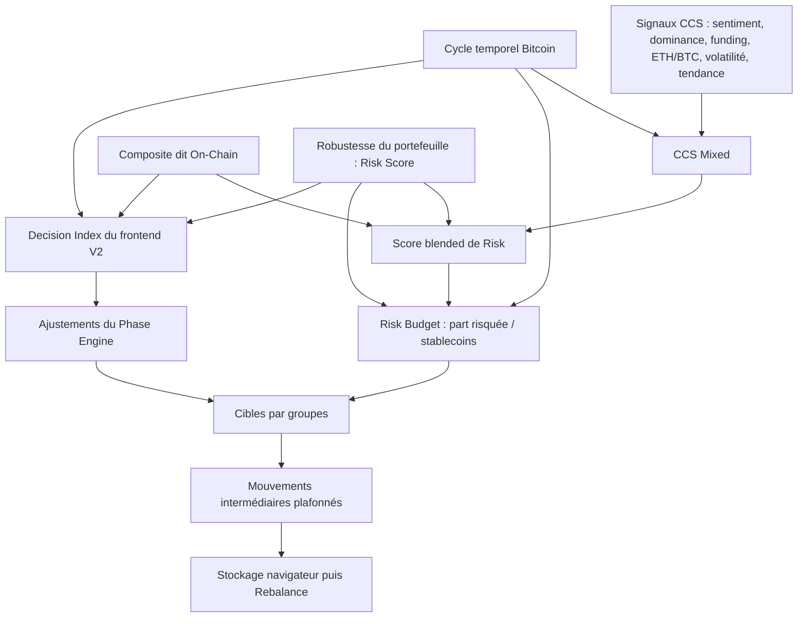

# Audit de la chaîne de décision crypto

Date : 9 septembre 2026. Code audité : HEAD `bedf2d9` du 29 juillet 2026, avec l'état local existant. Usage demandé : opérations au comptant, horizon de quelques semaines à quelques mois.

Complément demandé ensuite : [audit des modèles ML, de leur entraînement et de leur utilisation](D:/Python/smartfolio/docs/audit/CRYPTO_ML_AUDIT_2026-09-09.md). Il établit notamment une fuite temporelle dans les features de volatilité et plusieurs sorties ML prédéfinies.

## Avis

SmartFolio est une base intéressante d'aide à l'allocation : collecte de signaux, synthèse du risque, répartition par groupes, puis convergence progressive. En revanche, je ne considère pas la chaîne actuelle comme suffisamment fiable pour suivre directement ses propositions de rééquilibrage réel. Des incohérences de calcul sont reproductibles et les résultats de backtest ne démontrent pas encore l'avantage du moteur réellement affiché dans Analyse.

Il faut distinguer trois qualités : un logiciel qui applique correctement ses règles, des règles économiquement défendables, et une stratégie dont la performance future a une justification statistique. Les nombreux tests apportent de la valeur au premier niveau, sans suffire aux deux autres.

Audit du code et vérifications locales hors ligne. Aucun ordre, changement de stratégie active, accès aux clés d'exchange ou modification du code métier. L'état authentifié de ton navigateur, les scores précis affichés aujourd'hui et la fraîcheur des fournisseurs n'ont pas été vérifiés. Les reproductions sont des scénarios déterministes, pas des simulations de ton portefeuille réel.

## Le flux effectivement implémenté

Le DI ne détermine pas seul la cible de stablecoins. Cette cible vient principalement du score blended de Risk et du Risk Score. Le DI agit aussi sur les ajustements de phase de la poche risquée. Parallèlement, le moteur V2 calcule une autre allocation pour produire le DI et des métadonnées d'exécution. Ce chevauchement explique une partie de la complexité.

Sources : [orchestrateur](D:/Python/smartfolio/static/core/risk-data-orchestrator.js:188), [état unifié](D:/Python/smartfolio/static/core/unified-insights-v2.js:485), [cibles finales](D:/Python/smartfolio/static/core/unified-insights-v2.js:655), [affichage et transfert](D:/Python/smartfolio/static/components/unified-insights/execution-plan-renderer.js:183).

| Élément | Calcul ou rôle observé | Appréciation |
|---|---|---|
| CCS Mixed | Par défaut 70 % CCS + 30 % cycle temporel | Synthèse explicable, mais dépend de la qualité des sources |
| On-Chain Composite | Catégories blockchain, techniques/cycle, sentiment, contexte ; poids dynamiques | Plus large que son nom ; ce ne sont pas des confirmations indépendantes |
| Risk Score | Robustesse issue notamment de VaR, Sharpe, drawdown, volatilité et, selon la voie/version, structure | Bon sens général ; ne mesure ni une probabilité de perte ni la direction du marché |
| Score blended de Risk | 50 % CCS Mixed + 30 % On-Chain + 20 % Risk | Agrégat de marché et de portefeuille |
| Conditions de marché | Le calcul du régime retire la contribution Risk du blended | Séparation pertinente, à rendre explicite dans les libellés |
| DI du chemin V2 | Cycle/On-Chain/Risk pondérés, puis facteur de phase | Politique heuristique, sans probabilité prédictive calibrée |
| Theoretical Targets | Risk Budget + proportions de groupes + ajustements de contexte/phase | Cibles de politique d'allocation ; aucune optimalité rendement/risque démontrée |

Le régime ML par actif est encore un autre objet : il ne faut pas l'assimiler aux Conditions ni au score blended. Les guides locaux de revue Risk/Allocation contiennent encore la confusion DI = 65/45, contredite par AGENTS.md et le code actif. La documentation du backtest décrit également un cycle de production ML alors que le chemin Analyse V2 audité appelle le modèle temporel `estimateCyclePosition()`.

## Problèmes prioritaires

### 1. Le budget défensif n'est pas conservé dans les cibles finales — priorité haute

`calculateRiskBudget()` autorise 20 à 85 % de poche risquée, donc jusqu'à 80 % de stablecoins. Mais `computeMacroTargetsDynamic()` applique `max_stables ?? 60`. Le budget retourné ne fournit pas cette borne, donc la valeur 60 s'applique normalement.

Reproduction avec les fonctions réelles : **budget de 80 % stablecoins → cibles de 60 % stablecoins / 40 % risqué**. La poche risquée double par rapport aux 20 % demandés. Le Phase Engine actuel préserve ensuite la part de stablecoins qui lui est fournie ; il ne rétablit pas les 80 %.

Sources : [budget](D:/Python/smartfolio/static/modules/market-regimes.js:295), [plafond contradictoire](D:/Python/smartfolio/static/core/unified-insights-v2.js:171), [préservation en phase neutre/risk-off](D:/Python/smartfolio/static/core/phase-engine.js:600).

Correction : un contrat unique pour les bornes, puis une assertion bloquante `targets.Stablecoins == risk_budget.target_stables_pct`. Si un arbitrage modifie le budget, il doit produire un nouveau budget explicitement expliqué.

### 2. Le calcul des mouvements peut créer une cible négative au comptant — priorité haute

L'ajustement de somme nulle respecte un cap individuel, mais pas les contraintes `poids final >= 0` et `ne pas s'éloigner de la cible`. Il peut utiliser un groupe vide comme variable d'ajustement.

Exemple : portefeuille 100 % BTC ; cible 90 % ETH et 10 % SOL ; cap 7 points ; groupe Others vide. Résultat reproduit : **BTC 93 %, ETH 7 %, SOL 3,5 %, Others -3,5 %**. Les poids somment à 100 %, mais le portefeuille est impossible au comptant. Ce scénario teste un invariant, il ne prétend pas représenter ton allocation.

Sources : [ajustement](D:/Python/smartfolio/static/components/unified-insights/allocation-calculator.js:55), [construction des poids intermédiaires](D:/Python/smartfolio/static/components/unified-insights/execution-plan-renderer.js:246), [lecture Rebalance](D:/Python/smartfolio/static/modules/rebalance-controller.js:174).

Il s'agit d'une erreur démontrée au niveau proposition/transfert. Je n'ai pas établi qu'un exchange exécuterait une vente à découvert : les couches suivantes peuvent refuser, limiter ou transformer le plan.

Correction : projection des mouvements sur des contraintes simultanées : somme nulle, poids positifs, cap, sens du mouvement, absence de dépassement de cible, cash et frais. Définir séparément cap par groupe et turnover total : ±7 points par groupe n'est pas un plafond global de 7 % de capital déplacé.

### 3. Le backtest rééquilibre implicitement sans enregistrer les opérations — priorité haute

Le moteur applique chaque jour les mêmes `current_weights`, sans les faire dériver après les rendements des actifs. Ces poids ne changent que lorsqu'un rééquilibrage explicite est enregistré. Cela simule une remise aux poids antérieurs implicite et gratuite.

Reproduction hors ligne avec le moteur réel : capital 100, portefeuille 50 % BTC / 50 % cash, prix BTC **100 → 200 → 100**, aucune transaction, cash sans rendement. Le portefeuille réellement détenu revient à **100**. Le moteur termine à **112,5**, avec **zéro rééquilibrage enregistré**.

Source : [rendement puis mise à jour des poids](D:/Python/smartfolio/services/di_backtest/di_backtest_engine.py:196). Les scripts de walk-forward utilisent ce même moteur : [appel](D:/Python/smartfolio/scripts/analysis/walk_forward_rotation_v2.py:231).

Autre problème comptable : `daily_returns` est alimenté avant déduction des coûts de transaction, puis utilisé pour Sharpe et volatilité. Les rendements de la courbe de capital sont nets de ces coûts alors que ces métriques ne le sont pas de façon cohérente : [frais](D:/Python/smartfolio/services/di_backtest/di_backtest_engine.py:264), [métriques](D:/Python/smartfolio/services/di_backtest/di_backtest_engine.py:372).

Correction : tenir les quantités et le cash, ou faire dériver les poids quotidiennement ; calculer turnover et frais depuis les valeurs détenues avant transaction ; dériver toutes les métriques de la même courbe nette. Le biais peut favoriser ou pénaliser une stratégie selon le chemin des prix : +12,5 % dans cet exemple n'est pas une estimation du biais historique total.

### 4. Le DI, ses explications et la voie serveur ne sont pas identiques — priorité haute

Le flag `topdown_v2: true` choisit normalement un calcul frontend. Les poids sont 33/39/28, puis 40/37/23 si cycle >= 70 et 45/35/20 si cycle >= 90. Facteurs de phase : 0,85 / 1 / 1,05.

L'objet renvoyé ne fournit pas les poids au panneau, qui affiche par défaut **50/30/20** et calcule ses contributions avec eux. Le lecteur ne peut donc pas reconstruire le DI à partir de l'explication affichée.

La pénalité macro VIX/DXY est appliquée dans le registre serveur, mais pas dans ce calcul frontend V2. Analyse lit la pénalité pour ses métadonnées sans la soustraire au DI affiché. La voie serveur utilise de plus un cycle simulé par phase et un score canonique comme On-Chain : c'est une autre méthode, pas un secours équivalent.

Sources : [voie V2](D:/Python/smartfolio/static/core/strategy-api-adapter.js:211), [formule](D:/Python/smartfolio/static/core/strategy-api-adapter.js:460), [poids affichés](D:/Python/smartfolio/static/modules/analytics-unified-main-controller.js:373), [macro affichée](D:/Python/smartfolio/static/modules/analytics-unified-main-controller.js:543), [calcul serveur](D:/Python/smartfolio/services/execution/strategy_registry.py:252).

Correction : une fonction canonique qui retourne score, entrées, poids effectifs, facteur de phase, pénalités, provenance, qualité et version. Frontend, backtest et propositions doivent consommer cette même définition.

### 5. Une donnée absente peut encore produire un score présentable — priorité haute

Le module CCS remplace des échecs fournisseurs par des constantes. Avec les six constantes de secours et les poids par défaut actuels, le calcul retourne **44,88**, horodaté au moment du calcul. Les sources sont marquées fallback dans l'objet, mais le score numérique reste utilisable dans la chaîne.

Autre reproduction, limitée à la conversion d'une allocation V2 valide : avec les trois scores absents, les remplacements à 50 produisent **DI 43** en phase bearish et une confiance codée en dur de **0,8**. La couche unifiée peut ensuite réduire cette confiance ; le panneau en recalcule encore une autre. Une qualité de calcul de 80 % ne doit pas être comprise comme une probabilité de réussite de 80 %.

Sources : [secours CCS](D:/Python/smartfolio/static/modules/signals-engine.js:268), [conversion DI](D:/Python/smartfolio/static/core/strategy-api-adapter.js:477), [confiance du panneau](D:/Python/smartfolio/static/modules/analytics-unified-main-controller.js:378).

Correction : distinguer données valides, périmées, absentes et synthétiques. Une entrée critique absente doit rendre la proposition indisponible, ou explicitement conserver les positions, avec raison et date des observations. Le composite On-Chain sait déjà retourner `null` sans indicateurs : généraliser ce comportement est une bonne base.

### 6. La transmission Analyse → Rebalance manque d'identité de portefeuille — priorité moyenne à haute

La clé `unified_suggested_allocation` est globale au navigateur. Le payload ne contient ni utilisateur ni source de portefeuille à vérifier à la lecture. Le champ `source` signifie ici écran producteur, pas source des balances. Deux portefeuilles/sources peuvent donc partager des cibles encore considérées fraîches.

En outre, la deuxième sauvegarde conserve l'ancien `iter1_targets`, recalcule les cibles théoriques et appose une nouvelle date sans vérifier qu'ils correspondent au même instant de décision.

Sources : [deuxième sauvegarde](D:/Python/smartfolio/static/modules/analytics-unified-main-controller.js:18), [lecture et fraîcheur](D:/Python/smartfolio/static/modules/rebalance-controller.js:130).

Correction : proposition versionnée avec user_id, source_id, snapshot des positions, version du modèle, date des données, date de calcul, cap et empreinte commune pour cibles finales/intermédiaires. Invalider lors d'un changement de portefeuille ou après transactions. Ce constat porte sur les propositions navigateur, pas sur une fuite de balances backend démontrée.

## Appréciation quantitative

### Le cycle est un scénario de contexte, pas une prévision validée

La calibration cherche cinq paramètres sur trois couples sommet/creux historiques. Elle récompense un score proche de 100 au sommet et proche de 10 au creux. La recherche parcourt jusqu'à 8 640 combinaisons. Ce faible nombre de cycles indépendants limite fortement les conclusions possibles.

La confiance est principalement une heuristique de proximité au centre d'une phase, avec bonus de recalibration récente. Ce n'est pas un taux de réussite mesuré sur des décisions futures indépendantes : [calibration](D:/Python/smartfolio/static/modules/cycle-navigator.js:108), [confiance](D:/Python/smartfolio/static/modules/cycle-navigator.js:434).

Le cycle agit dans CCS Mixed, directement dans le DI, dans ses poids adaptatifs, son multiplicateur et certains ajustements d'allocation. La pénalité de direction descendante est utile, mais ne neutralise pas cette influence multiple.

Les seuils créent des discontinuités : On-Chain et Risk fixés à 50, un cycle passant de **69,99 à 70** fait passer le DI de **48 à 58** ; de **89,99 à 90**, le DI passe de **66 à 71**. Reproductions des fonctions actuelles, pas de prix de marché. Une hystérésis ou interpolation réduit les sauts, mais ne rend pas le signal prédictif par elle-même.

### Les scores ne sont pas indépendants et leurs horizons se mélangent

Le composite nommé On-Chain comprend, en poids de base avant adaptation, 40 % de blockchain, 35 % de cycle/technique, 15 % de sentiment et 10 % de contexte. CCS contient déjà sentiment, volatilité et tendance ; Risk contient encore volatilité, Sharpe et drawdown. Il existe une réduction de redondance à l'intérieur de certaines catégories, mais cela ne démontre pas l'indépendance entre les piliers.

De plus, Fear & Greed contribue dans un sens au CCS et peut être inversé dans le composite pour une lecture contrariante. Une logique de tendance et une logique de valorisation peuvent coexister, mais il faut définir leur horizon et tester séparément leur apport : [catégories](D:/Python/smartfolio/static/modules/indicator-categories-v2.js:12), [normalisation CCS](D:/Python/smartfolio/static/modules/signals-engine.js:286).

Le Risk Score est conceptuellement défendable comme robustesse historique. Son introduction dans le signal de décision, puis à nouveau dans le budget, crée une dépendance forte à la composition actuelle. C'est acceptable pour contraindre une allocation, mais pas pour interpréter le score comme une prévision de marché commune à tous les portefeuilles.

Enfin, stablecoins, monnaie bancaire, actifs bridgés et tokens stakés ne présentent pas les mêmes risques. Leurs risques de décrochage, contrepartie et liquidité doivent être traités explicitement dans les contraintes et les scénarios. Voir la [BRI sur les risques crypto](https://www.bis.org/publ/bppdf/bispap138.pdf) pour les mécanismes de liquidité et de contagion.

### Le travail de backtest existe, mais ne valide pas encore le modèle live

Le projet contient des stratégies Replica, TrendGate, Rotation et Adaptive Continuous, ainsi que des fenêtres de test progressives. C'est une base à conserver. Cependant :

- Le backtest utilise un proxy prix du On-Chain et un proxy BTC du Risk Score, au lieu des entrées réellement employées dans Analyse. Les versions V2 modifient aussi phase et normalisation. Une variante BTC/ETH/stables ne valide pas la sélection des altcoins des onze groupes.
- Les résultats documentés dépendent du moteur comptable défectueux décrit plus haut et doivent être recalculés.
- Le label « ROBUST » repose notamment sur le ratio Sharpe test / Sharpe entraînement. Ce ratio est instable près de zéro, trompeur avec des Sharpe négatifs, et ne prouve pas l'absence de surajustement.
- Comparer plusieurs variantes puis recommander celle qui gagne sur les fenêtres dites hors échantillon transforme ces fenêtres en outil de sélection. Il faut ensuite une nouvelle période de confirmation indépendante.
- La courbe de cycle est calibrée sur des sommets connus jusqu'à 2022. Toute validation prétendant simuler une décision antérieure doit n'utiliser que des paramètres disponibles à cette date, ou signaler qu'elle teste une règle conçue rétrospectivement.

Sources : [proxies](D:/Python/smartfolio/services/di_backtest/data_sources.py:196), [formules historiques](D:/Python/smartfolio/services/di_backtest/historical_di_calculator.py:29), [critère ROBUST](D:/Python/smartfolio/scripts/analysis/walk_forward_rotation_v2.py:444), [recommandation documentée](D:/Python/smartfolio/docs/DI_BACKTEST_MODULE.md:620).

La littérature sur le [surajustement des backtests](https://www.davidhbailey.com/dhbpapers/backtest-prob.pdf) explique pourquoi multiplier les essais et retenir le meilleur résultat peut créer une fausse impression de validité. Cela justifie une validation supplémentaire ; cela ne démontre pas que tout signal SmartFolio est inutile.

## Le modèle que je comparerais en priorité

Pour cet horizon au comptant, je privilégierais une **allocation pilotée par la tendance et limitée par le risque**, avec peu de paramètres. Sa supériorité reste à tester.

1. **Signal marché indépendant du portefeuille.** Tendance BTC/ETH sur quelques horizons préétablis, par exemple 1/3/6 mois, et participation des grandes capitalisations liquides. Modèle de référence simple, face auquel toute couche supplémentaire doit démontrer son apport. La recherche de [Liu et Tsyvinski](https://www.nber.org/papers/w24877) documente un effet historique de momentum crypto ; elle ne garantit pas sa performance aujourd'hui.
2. **Dimensionnement du risque séparé.** Volatilité réalisée lissée, covariance stabilisée, scénarios de drawdown et liquidité. Déterminer la taille de la poche risquée, au lieu de transformer la robustesse actuelle en signal haussier. Un score bas devrait pouvoir conduire à améliorer la structure, pas uniquement vendre mécaniquement tout le marché après une baisse.
3. **Allocation sous contraintes.** Univers réellement négociable, plafonds par token/groupe/contrepartie, stablecoins différenciés, turnover et frais. Inclure la pénalité de changement de portefeuille dans le choix des cibles.
4. **Cycle et On-Chain comme modulations limitées.** Conserver leur lecture contextuelle, mesurer leur valeur ajoutée par retrait successif, et augmenter leur influence seulement si les résultats indépendants le justifient. Éviter de leur attribuer d'emblée des poids prétendument optimaux.
5. **Exécution discrète et traçable.** Évaluation quotidienne possible, décisions hebdomadaires ou selon bandes de dérive, avec signaux datés avant l'ordre, coûts réalistes, seuil minimal de transaction et validation finale au comptant.

Les variantes TrendGate et Rotation déjà présentes peuvent servir de candidats. Je ne recommanderais pas d'ajouter immédiatement un réseau neuronal plus complexe. Si l'objectif devient une vraie prévision, définir d'abord la cible, par exemple rendement relatif BTC/cash à 30 ou 90 jours, puis commencer par un modèle régularisé calibré et validé dans le temps. Une probabilité de hausse seule ne suffit pas : l'amplitude des pertes et les frais comptent aussi.

## Ordre des améliorations

1. Corriger les trois invariants reproduits : budget stablecoins, positivité/convergence des mouvements et comptabilité du backtest.
2. Unifier DI, poids affichés, macro, qualité des données et identité des propositions. Simplifier les doubles chargements et caches autour d'un snapshot cohérent.
3. Rejouer les comparaisons existantes avec les corrections et un délai réaliste signal → exécution. Mesurer performance nette, drawdown, temps de récupération, turnover et stabilité des allocations.
4. Comparer à conservation BTC, allocation BTC/ETH/stables fixe et règle de tendance simple, à risque comparable. Tester les périodes difficiles séparément et les frais/slippage plus élevés.
5. Tester le retrait du cycle, du composite On-Chain, du sentiment et des overrides. Conserver uniquement la complexité qui améliore les résultats indépendants de façon stable.
6. Enregistrer les décisions réelles à partir d'un modèle figé, puis suivre quelques mois en simulation à ton rythme d'investissement. Cette période valide surtout le fonctionnement et les coûts ; quelques mois ne prouvent pas la robustesse sur un cycle complet.

## Vérifications réalisées et limites

- 246 tests Python ciblés : toutes les assertions passent. La commande finit néanmoins avec un statut d'échec parce que le seuil global de couverture de 30 % ne peut pas être atteint par ce sous-ensemble ; couverture globale mesurée 2,19 %. Aucun prétendu succès de la suite complète.
- 10 tests JavaScript existants du moteur d'allocation : tous passent.
- Reproductions supplémentaires hors ligne : 80 → 60 % de stablecoins ; poids intermédiaire -3,5 % ; DI de secours 43 ; CCS de secours 44,88 ; sauts du DI aux seuils 70/90 ; capital fictif 112,5 au lieu de 100 sans rééquilibrage.
- Les probes frontend exécutent les fonctions pures extraites du code actuel avec environnement minimal. Elles prouvent les comportements des fonctions, pas l'état actuel d'une session utilisateur. Le probe Python utilise directement le moteur de backtest.
- Les assertions existantes ne couvrent pas tous ces invariants. Aucune campagne historique complète n'a été relancée : ses conclusions seraient prématurées avant correction comptable.

Artifacts : [probes et résultats](D:/Python/smartfolio/outputs/audit-crypto-2026-09-09/frontend-results.json), [reproduction frontend](D:/Python/smartfolio/outputs/audit-crypto-2026-09-09/probe_frontend.mjs), [reproduction backtest](D:/Python/smartfolio/outputs/audit-crypto-2026-09-09/probe_backtest.py).
